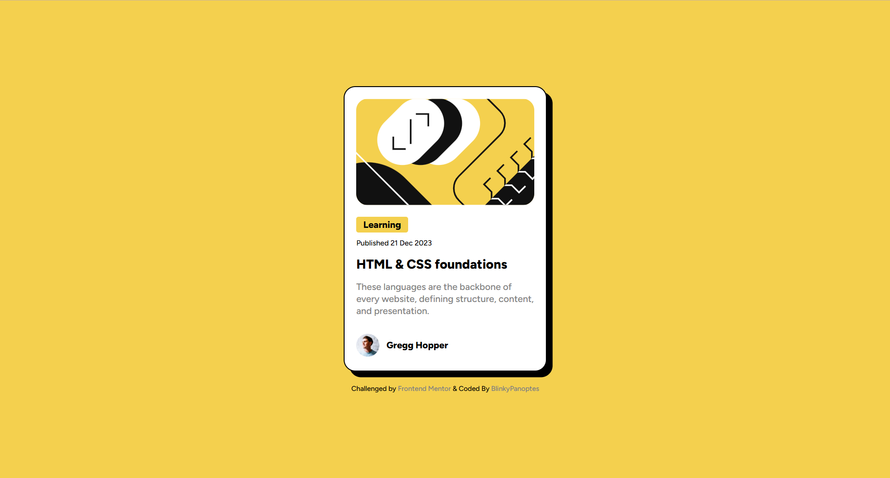
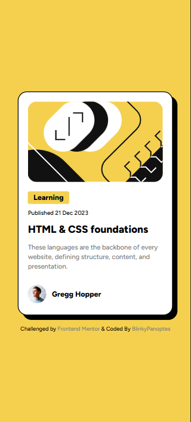

### Continued development

For the next steps, I plan to:
- Add `:hover` and `:active` states to the card and title to improve interactivity.
- Experiment with CSS Transitions to make the shadow move when the user interacts with the card.

### AI Collaboration

- I used AI primarily as a **linter/code reviewer** to double-check my syntax for typos and ensure my HTML structure was following best practices. 

## Author

- Frontend Mentor - @BlinkyPanoptes https://www.frontendmentor.io/profile/BlinkyPanoptes

---

# Frontend Mentor - Blog preview card solution

This is a solution to the [Blog preview card challenge on Frontend Mentor](https://www.frontendmentor.io/challenges/blog-preview-card-ckPaj01IcS). 

## Table of contents

- [Overview](#overview)
  - [The challenge](#the-challenge)
  - [Screenshot](#screenshot)
  - [Links](#links)
- [My process](#my-process)
  - [Built with](#built-with)
  - [What I learned](#what-i-learned)
  - [Continued development](#continued-development)
  - [AI Collaboration](#ai-collaboration)
- [Author](#author)

## Overview

### The challenge

Users should be able to:

- View the optimal layout for the content depending on their device's screen size
- See hover and focus states for all interactive elements on the page (to be implemented in future iterations)

### Screenshot

#### Desktop


#### Mobile


### Links

- Solution URL: https://github.com/BlinkyPanoptes/blog-preview-card.git

- Live Site URL: https://blinkypanoptes.github.io/blog-preview-card/

## My process

### Built with

- Semantic HTML5 markup
- CSS Custom Properties
- Flexbox
- Mobile-first workflow
- Custom @font-face integration (Figtree)

### What I learned

This project was a great exercise in handling local font files and perfecting the "Neo-brutalist" shadow effect. I focused on making the card responsive using a combination of `max-width` and percentage-based widths to ensure it looks good on all mobile devices.

I also learned how to use and apply the `<time>` element for better accessibility:
```html
<p class="date">Published <time datetime="2023-12-21">21 Dec 2023</time></p>